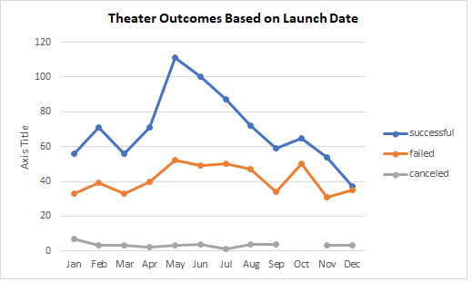

# Kickstarting with Excel
## Overview of Project
The purpose of this analysis is to determine possible factors contribute to the success or failure of fundraising campaigns on the Kickstarter platform.  The data is from a collection of over 4,000 historical Kickstarter campaign records from 2009 to 2017.

Here is the link to the Excel file
[Kickstarter_Challenge_Excel_File](Kickstarter_Challenge.xlsx)
## Analysis and Challenges
### Analysis of Outcomes Based on Launch Date
For this analysis, I use the pivot table to look the fundraising outcomes for all theater projects.  In particular, I want to see if campaign launch month will have correlation to success or failure to the outcomes.  I created below chart from the data

### Analysis of Outcomes Based on Goals
### Challenges and Difficulties Encountered

## Results
- Two conclusions I can draw from the Theater Outcomes by Launch Date are
    1. Fundraising campaigns for theater projects tend to have a higher success rate if launched during the months of May, June, and July. 
    1. Campaigns launched during December tend to have a lower success rate
- Conclusion from the Outcomes based on Goals is that most fundraising campaigns for Theater/Plays have a budget goal of less than $15,000.  For these lower budget plays, projects with a fundraising goal of less than $5,000 have a high rate of success (over 70% success rate).
- Some limitations of this dataset to note for the two analysis are:
    1. For the analysis of outcomes based on launch date, data are aggregated from a spend of nine years.  Although the aggregated data seems to indicate the Summer months have a better success rate, when looking at individual years, the pattern is not as clear.  Thus the aggregated data may have less predictive power than one may expect 
    1. sample size for higher budget Theater/Plays projects are limited, therefore the historic success rate for these higher budget campaigns are less useful in predicting future success rate for a similar type of projects
- Some additional analysis ideas for this set of data includes:
    1. It will be interesting to look at the ratio of success vs. failed campaigns by year and by size.  The data may show success rate can be impacted by economic conditions.
    1. We can also do some analysis on whether "staff pick" makes a difference in campaign outcomes
