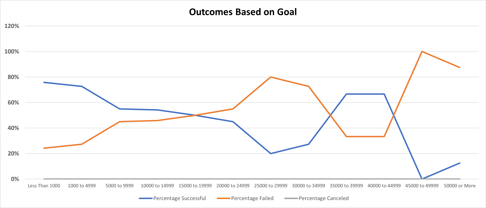

# Kickstarting with Excel

## Overview of Project
The purpose of this analysis is to determine possible factors that contribute to the success or failure of fundraising campaigns on the Kickstarter platform.  The data is from a collection of over 4,000 historical Kickstarter campaign records from 2009 to 2017.

Below is the link to the Excel file with original data in the "Kickstarter" tab

[Kickstarter_Challenge_Excel_File](Kickstarter_Challenge.xlsx)

## Analysis and Challenges
### Analysis of Outcomes Based on Launch Date
For this analysis, I use the pivot table to look at the fundraising outcomes for all "Theater" projects in the dataset.  In particular, I want to see if the campaign launch month will have a correlation to the success or failure of the outcomes.  I created the below chart from the data to help visualize the data.

### Analysis of Outcomes Based on Goals
For this analysis, I like to see if different fundraising goals may contribute to the success or failure of campaigns for all projects in the "Plays" subcategory.  To do that, I separated data into different buckets by fundraising goal dollar amount and list out the corresponding outcomes by counts and percentages.  I created below chart from the data to help in identifying possible trends or patterns.

### Challenges and Difficulties Encountered
- It took some time to familiarize myself with the dataset so I can understand why certain analysis was asked to be conducted.  
- Columns with non-categorizable text such as “name” and “blurb” may contain interesting information but are difficult to be analyzed within Excel.  

## Results
- The two conclusions I can draw from the Theater Outcomes by Launch Date are:
    - Fundraising campaigns for theater projects tend to have a higher success rate if launched during the months of May, June, and July. This could be that people have more free time and discretionary budget for entertainments during the Summer months when schools are in recess.   
    - Campaigns launched during December tend to have a lower success rate.  With year end and holidays, discretionary budget could be limited and that may contribute to the low success rate for the December month.
- Conclusion from the Outcomes based on Goals is that most fundraising campaigns for Theater/Plays have a budget goal of less than $15,000.  Within these lower budget plays, projects with a fundraising goal of less than $5,000 have a high rate of success (over 70% success rate).
- Some limitations of this dataset to note for the two analysis are:
    - For the analysis of outcomes based on launch date, data are aggregated from a spend of nine years.  Although the aggregated data seems to indicate the Summer months have a better success rate, when looking at individual years, the pattern is not as clear.  Thus the aggregated data may have less predictive power than one may expect 
    - Sample size for larger budget Theater/Plays projects are limited. Therefore the historic success rate for these higher budget campaigns are less useful in predicting future success rate for a similar type of projects.
- Some additional analysis ideas for this dataset includes:
    - It will be interesting to look at the ratio of success vs. failed campaigns by year and by budget size.  The data may show success rate can be impacted by prevailing economic conditions.
    - We can also do some analysis on whether "staff pick" makes a difference in campaign outcomes
